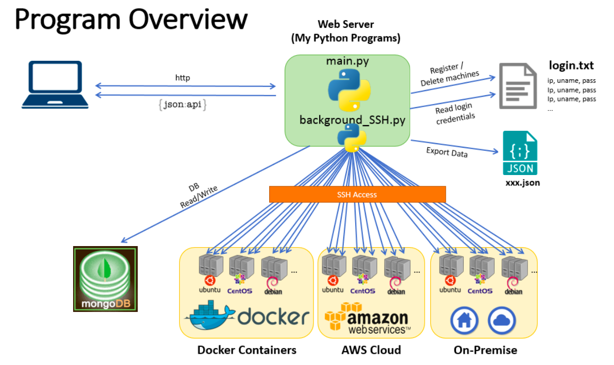

Management Application for Linux Machines
=========================================

## Table of Contents
1. [Introduction](#1-introduction)
2. [Install packages](#2-install-packages)
3. [Try it out](#3-try-it-out)
    - [With test infrastructure for a demo (Docker containers)](#1-if-you-run-with-the-test-docker-environment)
    - [With your own infrastructure](#2-if-you-run-with-your-own-infrastructure)
4. [Documentation](#4-documentation)


<br>
## 1. Introduction
This program is a simple management application for Linux machines (Physical/Virtual) that automatically and periodically collects basic machine data via SSH including some performance data (CPU, Memory, Disk), and lets administrators view them from the management portal (GUI).  
By using this application, administrators can manage their Linux machines (Ubuntu, Debian, CentOS etc.) on Docker containers, AWS cloud, and/or on-premise physical/virtual environment from the central management portal without manually logging in to each machine from the console.

  

For more details, please see the documentation [here](#4-documentation).  
All features are demonstrated with screenshots in the document.

**Key Features**
- Manage linux machines on Docker containers, AWS cloud, and/or on-premise environment
- Present basic machine data on the central management portal 
   (Hostname, IP Address, MAC Address, OS/Version, uptime, CPU load, memory usage, disk usage) 
- Register/Delete machines to be managed from GUI and/or a text file 
- Track machine status and display it with icons 
- Incident alarms with icons when a reachability to machines is lost 
- Export machine data as a JSON file 
- Expose machine data via RESTful API (JSON) 
- SSH access to machines from web browsers (provided by an external python application)

## 2. Install packages
This program supports only Python 2.x on Linux or OS X. Python 3.x and Windows are not supported.  
Following python modules are required to run this program.
- flask
- pymongo
- pexpect
- butterfly(optional)

To install:

```
$ pip install flask pymongo pexpect butterfly
```

> [Butterfly](https://github.com/paradoxxxzero/butterfly) is an xterm compatible external terminal application that runs in your browser.  
> If you don't install it, the program will not provide the feature of browser-based terminal access.  


## 3. Try it out
This program requires any physical/virtual infrastructure with Linux machines to be managed, and a MongoDB server for storing the machine data.   
You can execute the program either by:

**1. Using test environment with docker containers**    
    This program provides test environment with docker containers for the demonstration purpose.
    A shell script provided with the program automatically deploys the following containers on your local machine:  
- MongoDB server * 1  
- Linux machines * 10 (Ubuntu * 5, CentOS * 3, Debian * 2)

**2. Using your own pysical/virtual infrastructure with Linux machines/VMs/containers**  
    You can also use your production infrastructure, but please make sure that this program is aimed for demonstrating my classwork and the use of this software is AT YOUR OWN RISK.

>Using the docker test environment will be much simple and easier.


### (1) If you run with the test docker environment
#### Step 1. Install docker on your machine 

To deploy the test environment, Docker Engine and Docker Compose are required.

**For OS X:**   
- Install Docker toolbox  
    https://www.docker.com/products/docker-toolbox  


**For Linux:**  
- Install Docker Engine  
    https://docs.docker.com/engine/installation/  

- Install Docker Compose  
    https://docs.docker.com/compose/install/


#### Step 2. Run docker_setup.sh  
Run the shell script from the program directory.

```
$ cd ~/PATH_TO_THE_PROGRAM_DIRECTORY
$ ./docker_setup.sh
```

>(OS X only) You will be asked to enter your admin password to add the static route to the test network.


#### Step 3. Access to web server from your web browser
Access to `http://ipaddress:5000` from any web browser.  

>If you execute the program on your local machine, _ipaddress_ is localhost or 127.0.0.1

<br>
**Test containers to be deployed**  

Hostname | Container name  | IP Address  | Username | Password | OS/Version
----     | ---             | ----        | ---      | ---      | ---
 vm01    | vm01            | 172.30.0.1  | ubuntu   | ubuntu   | Ubuntu 14.04.4
 vm02    | vm02            | 172.30.0.2  | ubuntu   | ubuntu   | Ubuntu 14.04.4
 vm03    | vm03            | 172.30.0.3  | centos   | centos   | CentOS 6.7
 vm04    | vm04            | 172.30.0.4  | debian   | debian   | Debian 8
 vm05    | vm05            | 172.30.0.5  | centos   | centos   | CentOS 6.7
 vm06    | vm06            | 172.30.0.6  | ubuntu   | ubuntu   | Ubuntu 14.04.4
 vm07    | vm07            | 172.30.0.7  | debian   | debian   | Debian 8
 vm08    | vm08            | 172.30.0.8  | ubuntu   | ubuntu   | Ubuntu 14.04.4
 vm09    | vm09            | 172.30.0.9  | ubuntu   | ubuntu   | Ubuntu 14.04.4
 vm10    | vm10            | 172.30.0.10 | centos   | centos   | CentOS 6.7
 _N.A_   | mongo           | 172.30.0.99 | _N.A_    | _N.A_    | MongoDB 3.2
 \* MongoDB: port = TCP/27017, db = VM, collection = vm


#### Step 4. Destroying the demo environment
The shell script shutdowns and deletes all containers and settings on your local machine.

1. Stop the program (CTRL + C)
2. Run docker_destroy.sh from the program directory

        $ ./docker_destroy.sh


### (2) If you run with your own infrastructure
1. Prepare a MongoDB server which can be accessed from the machine this program will be executed
2. Prepare your infrastructure with linux servers and/or virtual machines (SSH access must be permitted on each machine)   
    If you manage EC2 instances on AWS, please place .pem file under ~/.ssh/ and run below command.

        $ ssh-add ~/.ssh/KEY_PAIR_NAME.pem

3. (Optional) Add IP Address, username, password of each Linux machine in "login.txt". You can also operate this step later through GUI 
4. Start the python program (main.py)

        $ cd ~/PATH_TO_THE_PROGRAM_DIRECTORY
        $ python main.py        

5. Access to `http://IPADDRESS:5000` from any web browser  

>If you execute on your local machine, _IPADDRESS_ is localhost or 127.0.0.1.  
>The program will ask you to enter the IP address of your MongoDB Server at the beginning


## 4. Documentation
See the documentation [here](https://1drv.ms/b/s!AkRAr6rw0sUWgR3_lrl7csNBX2Ie) for more details.  
All features are demonstrated with screenshots.


